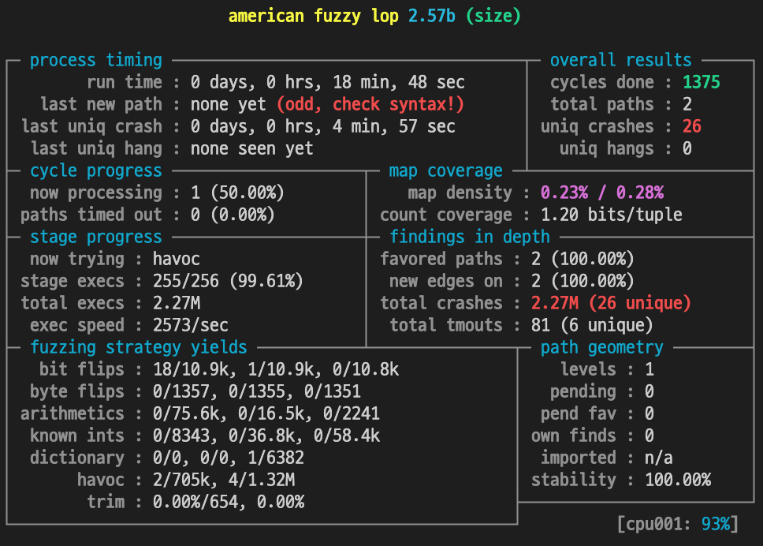
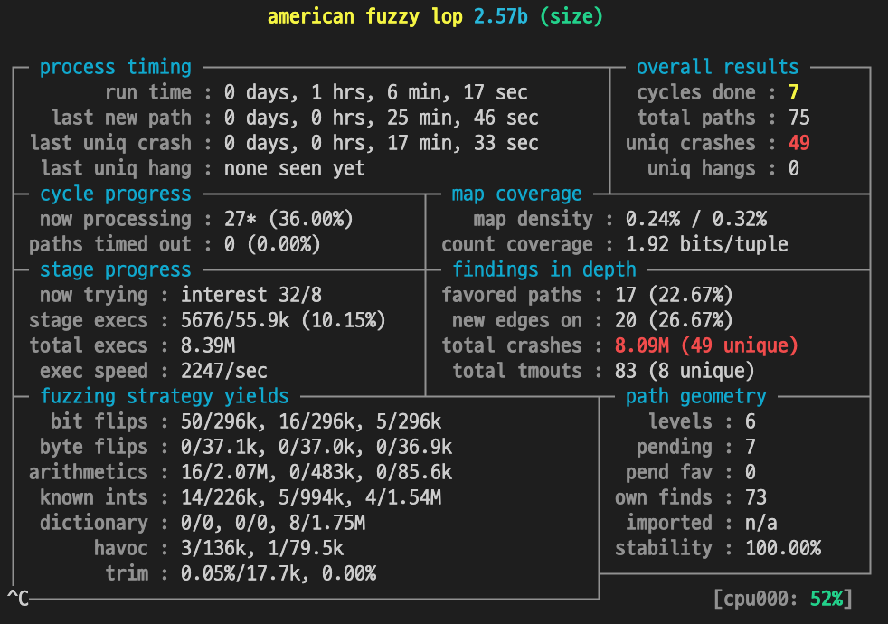
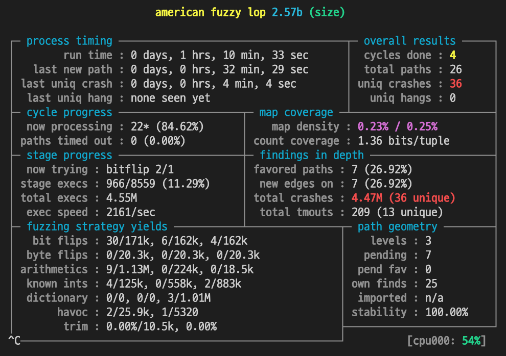

### 1. Why did you need to change `is_png_chunk_valid`?

The test cases generated by `afl-fuzz` are made by mutation of input set, so it is unlikely to be created as a complete png file. This means that every chunks of mutation file are less likely to have a vaild `crc` value. The `is_png_chucnk_vaild` function tests whether the `crc` value of `chunk` is valid, and most inputs fail in this function during the `read_png_chunk` and exit without executing any other part of the code.

This is why `is_png_chunk_vailed` was modified to return `1` in order that the test cases can deliberately pass through the `is_png_chunk_vailed` branch, so that other parts of the code can be executed and tested.

The image below is the result of running `afl-fuzz` without changing the return value of `is_png_chunk_vailed`. After  almost 20 minutes, `afl-fuzz` couldn't find any other paths except the first 2 paths, and `afl-fuzz` speculates that there is something odd with the test process.

Case 1: Without changing return value of `is_png_chunk_vaild`

### 2. Why did we give you exactly TWO seeds for fuzzing?

Because of the performance of the test. This means the ability to test more paths and find unique crashes in less time.

Case 2: 2 Seed Inputs

Case 3: 1 Seed Input

The above image is the execution result when two input seeds are given, and the below image is the execution result when one input seed is given. Although there is a slight difference in the run time, we could observe about 1.4 times the unique crash and 2.9 times the total path in about an hour of running time. Considering that unique crashes take a lot longer to find as they increase, that's a huge difference. (I checked by `plot_data`, in two seeds case, it took 26 seconds to find 43 unique crashes.)

The reason for this difference is that if the exactly same two files is given, the input generated by mutation is more likely to be similar to the first input. The more the test case deviates from the normal input, the less likely it is to find the interesting path because it experiences more failures in the front.

### 3. Why did you have to use `afl-gcc` to compile the source (and not e.g. ordinary gcc)?

>This  is  a  helper  application  which  serves  as a drop-in replacement for gcc, used to recompile third-party code with the required runtime instrumentation for afl-fuzz.
>
>A common pattern would be to use this with the CC environment variable.

This is description of `afl-gcc`, provided by [ubuntu manual](http://manpages.ubuntu.com/manpages/bionic/man1/afl-gcc.1.html). In the binary file which is compiled by `gcc`, there is no code for check the code coverage. So, `afl-fuzz` has trouble in generating inputs, and cannot test that file. Therefore, AFL provided the 'afl-gcc' compiler tool, allowing to compile into binary files, which is testable for `afl-fuzz`.

### 4. How many crashes in total did AFL produce? How many unique crashes?

### 5. Why are hangs counted as bugs in AFL? Which type of attack can they be used for?

### 6. Which interface of `libpngparser` remains untested by `AFL` (take a look at `pngparser.h`)

The function `store_png` remains untested by AFL. That's because we test the binary file `size`, which is built from `size.c`.

There are 4 interfaces provided by `pngparser.h`. In the source code of `size.c`, structure `image` and function `load_png` are used directly, and the structure `pixel` is used as a member of `image`. However, the function `store_png` is not used, so it remains untested by AFL.

### 7. How long did you run AFL for? If you run it for twice as long, do you expect to find twice as many bug? Why?

